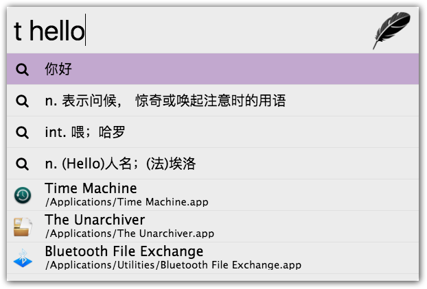

## Zazu 有道翻译插件

[Zazu] 是一个类似 [Alfred] 的快捷启动类开源项目，本插件使用[有道智云自然语言翻译]为其提供翻译功能。

## 用法

使用 `t` 作为前缀，然后加上想要翻译的文本，简单的翻译结果会在下方显示，选择其中一项可以复制翻译结果到剪贴板，有道会自动检测要语言类型。

```
t hello
```



## 安装

编辑文件 `～/.zazurc.json`，将 package 加入到 zazu 的扩展列表中，然后 Reload Config。

``` json
{
  "plugins": [
    {
      "name": "greatghoul/zazu-youdao",
      "variables": {
        "appKey": "your app key",
        "appSecret": "your app secret"
      }
    }
  ]
}
```

有道知云是收费 API，不过免费用户有一定的限额，对于日常使用来说，足够了，要使用本插件，
需要你自己申请一个有道智云的 API，详细步骤请参考[申请有道翻译 API]，
感谢 [crx-selection-translate] 项目提供的操作指南。

[Zazu]: http://zazuapp.org/
[Alfred]: https://www.alfredapp.com/
[有道智云自然语言翻译]: http://ai.youdao.com/product-fanyi.s
[申请有道翻译 API]: https://github.com/Selection-Translator/crx-selection-translate/wiki/%E7%94%B3%E8%AF%B7%E6%9C%89%E9%81%93%E7%BF%BB%E8%AF%91-API
[crx-selection-translate]: https://github.com/Selection-Translator/crx-selection-translate "让浏览任意语言的网站变得无比轻松的 Chrome 扩展程序"